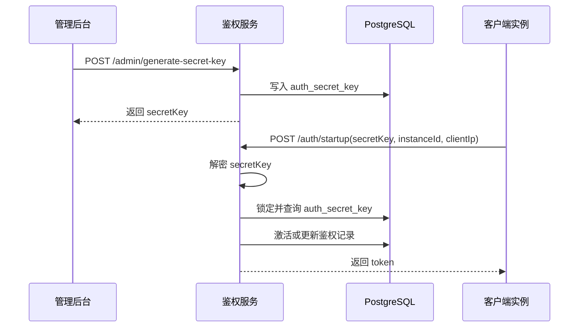

# 鉴权接口接入文档

本文档面向需要接入本服务的其他项目，说明 `secret_key` 的生成方式、启动鉴权流程、请求响应格式和错误处理建议。

## 1. 适用场景

本服务适用于“服务端预先发放激活码，客户端启动时进行鉴权”的场景，包含两类接口：

- 管理接口：`POST /admin/generate-secret-key`
  用于后台系统为某个账号生成 `secret_key` 并写入数据库。
- 鉴权接口：`POST /auth/startup`
  用于客户端在启动时携带 `secret_key`、实例标识和客户端 IP 获取访问 token。

## 2. 整体流程



## 3. 基础信息

- 协议：HTTP/HTTPS
- 数据格式：`application/json`
- 时间基准：服务端内部统一使用 UTC
- Swagger：`/docs`
- ReDoc：`/redoc`

示例基础地址：

```text
http://your-host:7544
```

## 4. 数据对象说明

### 4.1 secret_key

`secret_key` 是一个使用服务端主密钥签名生成的 JWT 字符串，长度不超过 255 字符。其 payload 包含：

- `userAccount`：账号标识
- `issuedAt`：签发时间戳
- `nonce`：16 位随机字符串

客户端不需要自行解析 `secret_key`，只需安全保存并在启动鉴权时原样上传。

### 4.2 startup token

`/auth/startup` 成功后返回一个访问 token，格式也是 JWT，payload 包含：

- `secretKeyId`
- `userAccount`
- `instanceId`
- `accountNum`
- `iat`
- `exp`

当前有效期默认 7200 秒。

## 5. 管理接口：生成 secret_key

### 5.1 接口定义

```http
POST /admin/generate-secret-key
```

### 5.2 请求头

| Header | 必填 | 说明 |
|---|---|---|
| `access_token` | 是 | 管理接口访问口令，当前默认值为 `huanzhan`，生产环境建议通过环境变量 `ADMIN_ACCESS_TOKEN` 配置 |

### 5.3 请求体

```json
{
  "userAccount": "test_user",
  "effectiveTime": "2026-04-11 12:00:00",
  "expiredDuration": "5d",
  "accountNum": 5
}
```

### 5.4 参数规则

| 字段 | 必填 | 说明 |
|---|---|---|
| `userAccount` | 是 | 1 到 100 位，只允许字母、数字、下划线 |
| `effectiveTime` | 否 | 格式 `yyyy-MM-dd HH:mm:ss`；为空时使用服务端当前 UTC 时间 |
| `expiredDuration` | 是 | 格式 `数字 + 单位`，仅支持 `h` 和 `d`，例如 `5h`、`3d` |
| `accountNum` | 否 | 1 到 9999 的整数，默认值为 1 |

### 5.5 成功响应

```json
{
  "success": true,
  "secretKey": "eyJhbGciOiJIUzI1NiIsInR5cCI6IkpXVCJ9...",
  "userAccount": "test_user",
  "effectiveTime": "2026-04-11 12:00:00",
  "expiredTime": "2026-04-16 12:00:00",
  "accountNum": 5,
  "message": "Secret key generated successfully"
}
```

### 5.6 失败响应

`401 Unauthorized`

```json
{
  "success": false,
  "code": "UNAUTHORIZED",
  "message": "Invalid access token"
}
```

`400 Bad Request`

```json
{
  "success": false,
  "code": "INVALID_PARAM",
  "message": "expiredDuration must be in format like '5h' or '3d'"
}
```

`500 Internal Server Error`

```json
{
  "success": false,
  "code": "SERVER_ERROR",
  "message": "Internal server error"
}
```

### 5.7 curl 示例

```bash
curl -X POST "http://your-host:7544/admin/generate-secret-key" \
  -H "Content-Type: application/json" \
  -H "access_token: huanzhan" \
  -d '{
    "userAccount": "test_user",
    "effectiveTime": "2026-04-11 12:00:00",
    "expiredDuration": "5d",
    "accountNum": 5
  }'
```

## 6. 鉴权接口：启动鉴权

### 6.1 接口定义

```http
POST /auth/startup
```

### 6.2 请求体

```json
{
  "secretKey": "eyJhbGciOiJIUzI1NiIsInR5cCI6IkpXVCJ9...",
  "instanceId": "host-a-001",
  "clientIp": "203.0.113.10"
}
```

### 6.3 参数规则

| 字段 | 必填 | 说明 |
|---|---|---|
| `secretKey` | 是 | 由管理接口生成的 JWT 字符串 |
| `instanceId` | 是 | 客户端实例唯一标识，长度 1 到 255 |
| `clientIp` | 是 | 客户端 IP，支持 IPv4 和 IPv6，长度不超过 45 |

### 6.4 服务端处理逻辑

1. 使用服务端主密钥解密 `secretKey`
2. 从 payload 中取出 `userAccount`
3. 根据 `secret_key + user_account + is_deleted = 0` 查询数据库
4. 检查当前时间是否在 `effective_time` 和 `expired_time` 范围内
5. 根据数据库状态执行：

- 未激活：
  设置 `is_activated = 1`
  设置 `active_instance_id = 当前 instanceId`
  写入 `activate_time / last_auth_time / last_auth_ip`
  将 `auth_count` 初始化为 1
  生成并返回 token
- 已激活：
  更新 `last_auth_time / last_auth_ip`
  `auth_count + 1`
  若 `instanceId` 发生变化，则将旧实例记录到 `last_active_instance`
  生成并返回 token

6. 将本次返回 token 保存到 `last_auth_response`

并发情况下，服务端会通过数据库行锁保证同一条 `secret_key` 激活过程的原子性。

### 6.5 成功响应

```json
{
  "success": true,
  "code": "SUCCESS",
  "message": "Authentication successful.",
  "retryable": false,
  "data": {
    "token": "eyJhbGciOiJIUzI1NiIsInR5cCI6IkpXVCJ9...",
    "expiresIn": 7200,
    "expiresAt": "2026-04-11T14:00:00Z",
    "secretKeyId": 123,
    "userAccount": "test_user",
    "instanceId": "host-a-001",
    "accountNum": 5,
    "activatedNow": true
  }
}
```

### 6.6 失败响应

`400 Bad Request`，`secret_key` 无法解密、JWT 非法、数据库中不存在对应记录时：

```json
{
  "success": false,
  "code": "INVALID_SECRET_KEY",
  "message": "Invalid secret key.",
  "retryable": false,
  "data": null
}
```

`403 Forbidden`，不在有效时间窗口内时：

```json
{
  "success": false,
  "code": "AUTH_TIME_OUT",
  "message": "Secret key is outside the allowed authentication time window.",
  "retryable": false,
  "data": null
}
```

说明：

- 如果当前时间早于 `effective_time`，服务端会返回 `AUTH_TIME_OUT`，同时 `retryable = true`
- 如果当前时间晚于 `expired_time`，服务端会返回 `AUTH_TIME_OUT`，同时 `retryable = false`

`500 Internal Server Error`

```json
{
  "success": false,
  "code": "SERVER_ERROR",
  "message": "Internal server error.",
  "retryable": true,
  "data": null
}
```

### 6.7 curl 示例

```bash
curl -X POST "http://your-host:7544/auth/startup" \
  -H "Content-Type: application/json" \
  -d '{
    "secretKey": "your-secret-key",
    "instanceId": "host-a-001",
    "clientIp": "203.0.113.10"
  }'
```

## 7. 接入建议

### 7.1 接入方推荐流程

1. 后台系统调用管理接口生成 `secret_key`
2. 将 `secret_key` 安全下发给目标项目
3. 目标项目启动时调用 `/auth/startup`
4. 将返回的 token 缓存到内存中，直到过期
5. 在服务重启或 token 过期后重新调用 `/auth/startup`

### 7.2 客户端建议

- 不要自行拼装或修改 `secret_key`
- 不要在日志中明文打印 `secret_key` 或 token
- `instanceId` 应尽量稳定，例如机器 ID、容器实例 ID、节点 ID
- `clientIp` 建议传客户端对外通信的真实 IP
- 如果收到 `AUTH_TIME_OUT` 且 `retryable = true`，说明还未到生效时间，可以稍后重试
- 如果收到 `INVALID_SECRET_KEY`，通常应视为密钥无效，不建议无限重试

## 8. 常见问题

### 8.1 `secret_key` 和 token 有什么区别？

- `secret_key` 是授权凭证，由管理接口生成，通常生命周期较长
- token 是启动鉴权成功后返回的短期访问凭证，默认有效期 7200 秒

### 8.2 同一个 `userAccount` 能生成多个 `secret_key` 吗？

可以。当前实现允许同一 `userAccount` 生成多条不同的 `secret_key` 记录。

### 8.3 是否支持 IPv6？

支持。`clientIp` 最大长度为 45，可存储标准 IPv6 字符串。

### 8.4 如何在线测试接口？

服务启动后可直接访问：

- `/docs`
- `/redoc`

## 9. 环境变量

接入和部署时，至少需要关注以下配置：

| 环境变量 | 说明 |
|---|---|
| `HOST` | 服务监听地址，容器部署建议使用 `0.0.0.0` |
| `PORT` | 服务监听端口 |
| `DATABASE_HOST` | PostgreSQL 主机 |
| `DATABASE_PORT` | PostgreSQL 端口 |
| `DATABASE_NAME` | 数据库名 |
| `DATABASE_USER` | 数据库用户 |
| `DATABASE_PASSWORD` | 数据库密码 |
| `SECRET_KEY_JWT_SECRET` | `secret_key` 生成和解密使用的主密钥 |
| `SECRET_KEY_JWT_ALGORITHM` | `secret_key` 算法，默认 `HS256` |
| `ACCESS_TOKEN_JWT_SECRET` | startup token 签名密钥 |
| `ACCESS_TOKEN_JWT_ALGORITHM` | startup token 算法，默认 `HS256` |
| `ACCESS_TOKEN_EXPIRES_IN_SECONDS` | token 有效期，默认 7200 秒 |
| `ADMIN_ACCESS_TOKEN` | 管理接口访问口令 |

## 10. 版本说明

本文档基于当前项目实现整理，若接口字段、错误码或业务规则后续调整，应同步更新本文档。
